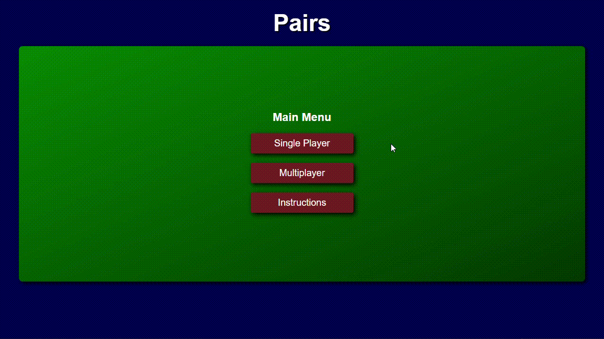

  <h1>Pairs</h1>
  
  

    An interactive card game for the web.
  

<h4>
    <a href="https://pairs-card-game.vercel.app">View Project</a>

 

<!-- About the Project -->

## Motivation

When I decided to learn Programming, Python was the first langauge I picked up. Python is a great language, however, building dynamic and interactive applications with a graphical user interface that is easily accessible in Python can prove challenging. Pairs started out initially as a terminal-based game built in Python. However, who wants to play a game in the terminal?

I wanted to make the application interative with a graphical user interface that was easy to use and could be shared easily on the web. This is how I fell into JavaScript and web development. Pairs has been through many iterations, UI/UX design changes, refactoring code for performance, optimizations and best practices, adding new features. I continue to work on the project with these implementations to test new programming and web development concepts.

The tech stack has changed over these iterations too, from a pure Python application to React => React + TypeScript + SASS => SolidJS + TypeScript + SASS. A server application was also implemented for the multiplayer feature, which uses the Socket.IO library to enable real-time, bi-directional communication between web clients and servers, a prominent feature for online multiplayer games. The server application currently uses [Deno](https://deno.com/).

<!-- TechStack -->

## Tech Stack (Current)

### Client

- [SolidJS](https://www.solidjs.com)
- [SASS](https://sass-lang.com)
- [TypeScript](https://www.typescriptlang.org)

### [Server](https://github.com/Excelsior2021/pairs-server)

- [TypeScript](https://www.typescriptlang.org)
- [Socket.IO](https://socket.io)

### Dev

- [Vitest](https://vitest.dev)
- [Solid Testing Library](https://github.com/solidjs/solid-testing-library)

## Approach

The current approach for this project on the frontend is to model the game as objects following the object-oriented programming paradigm. Previous iterations took a more functional approach. Being a game, I thought it made more sense to model the game as objects.

SolidJS was the UI framework of choice, It's in my opinion a better version than React, it's more performant and easier to work with.

I was doing a lot of manual testing to test the application but have realised the importance of automated tests as an application scales and/or becomes more complex. Vitest and Solid Testing library have been implemented to test the frontend.

## Deployment

The frontend for Pairs is deployed on [Vercel](https://vercel.com).

## Enhancements

This project can be enhanced with the following features:

- An improved algorithm for single player.
- Improved UX for multiplayer.
- Improve on the game's logic.
